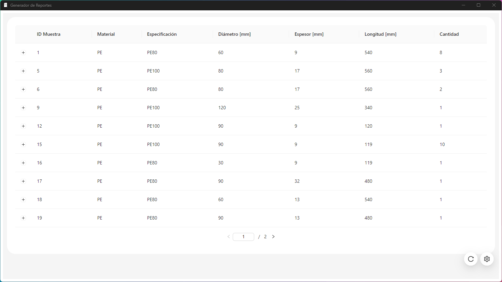

# Hoop Testing System


## Table of Contents
- [Hoop Testing System](#hoop-testing-system)
  - [Table of Contents](#table-of-contents)
  - [Description](#description)
  - [Installation](#installation)
  - [Contact Information](#contact-information)

## Description

The Hoop testing System is divided in three programs:

1. **Database Manager**: This program is responsible for managing the database that the project uses. It handles tasks such as creating, updating, and deleting database entries. It also manages the database schema and ensures that the database is properly structured and optimized for the project's needs. The Database Manager also handles any errors or issues that may arise with the database.

2. **Data Collector**
   
    This program is responsible for collecting and processing data. It may collect data from various sources such as APIs, web scraping, user input, or other databases. The Data Collector processes this data and transforms it into a format that can be easily used by the project. This may involve cleaning the data, removing unnecessary information, or converting the data into a different format.

3. **Report Generator**
    
    This program is responsible for generating reports based on the data collected and processed by the Data Collector. The Report Generator can create various types of reports such as charts, tables, or detailed written reports. These reports can be used to gain insights into the data and make informed decisions.

Each of these programs plays a crucial role in the project and they work together to ensure that the project functions smoothly. They each have their own responsibilities and tasks, but they also depend on each other to function properly.

## Installation

Instructions on how to install and set up your project. Include any prerequisites such as required software or hardware.

```bash
# Clone the repository
git clone https://github.com/eastanganelli/HoopTesting_System.git

# Navigate to the project directory
cd HoopTesting_System

# Initialize and clone the submodule
git submodule update --init --recursive
```

## Contact Information

[LinkedIn](linkedin.com/in/eastanganelli)